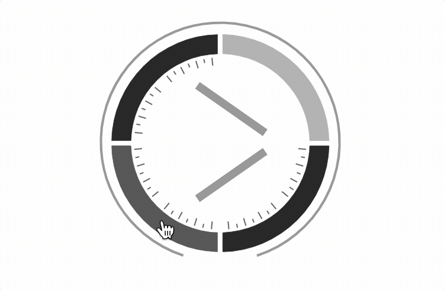
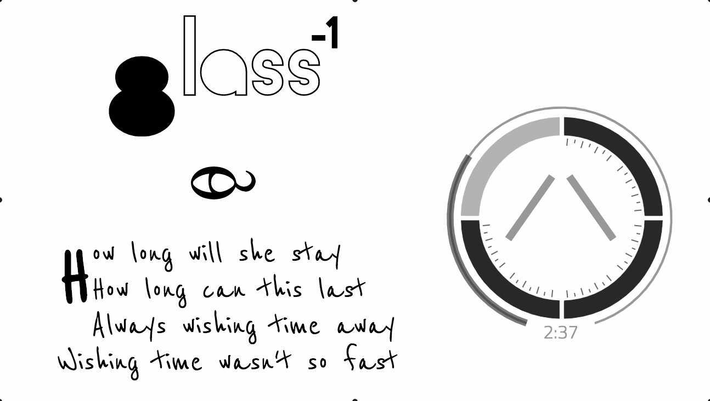

View live @ www.dirtymopmusic.com

Grounding the convenience of digital audio platforms in the artistic context that they sacrifice.  
The reunion of medium and message realized in experienced audio.     
############################# dirtyMOPmusic #############################   
While contemporary audio platforms operate more or less independently of their content, 
dirtyMOPmusic subordinates itself to its content. 
In doing so, it slips the listener into the complete sonic and artistic environment of each project, 
like a dusty old record sliding home into its sleeve. 
Though it won't warp like a record, it should warp your perspective sufficiently to appreciate each record you play. 
Unfortunately, there is only one record to play currently
(and considering how long it took to make that happen, I'm going to need some ideas... 
React composition to the rescue? To be determined)     
############################# TO THOSE WHO W8 #############################   
With design and implementation driven entirely by the art, 
listeners cannot experience the project without encountering its central themes.   
   
Every aspect of the platform immerses the listener in exactly the artistic context that its author intended. 
Rather than a linear navbar, the clock-like navigation widget forces the operator to confront the project's central themes: 
time and non-linearity, circles/cycles/loops/revolutions, decision making and uncertainty.   
Minimal audio controls encourage continuous playback. Automatically repeating the piece seamlessly hints that the project
was designed as a hermeneutic circle.   
   
All key project art is featured and arranged in a style that conveys the narrative. 
Like the music, the site itself is one giant semiotic puzzle. To solve it (impossible) the user will need to exploit yet another theme
of the piece: observing and drawing distinctions. To this end, the widget transforms from a clock into a lens capable of seeing the art behind artifice.  
   
Other small quirks and easter eggs abound. Hover over "wait" and your cursor will remind you yet again that the boundary between medium and message does not apply here. The layout of the songs page beneath the prologue, Heratic (not a typo), reflects a cross. And so on...     
##########################################################  
Settle in for a few loops, but remember to leave some breadcrumbs so you can make your way back out. 
